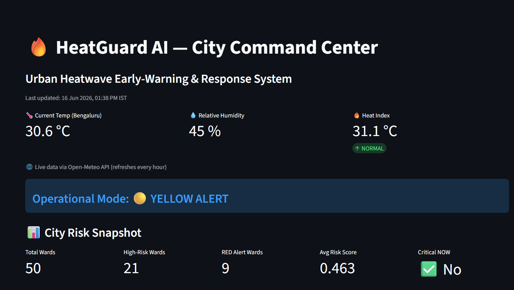

# 🔥 HeatGuard AI — Urban Heatwave Early-Warning & Response System

> An AI-powered decision-support system for municipal corporations, disaster management authorities, and urban planners to predict heatwave risk, prioritize vulnerable wards, and simulate policy interventions.

[](https://www.python.org/)
[](https://open-meteo.com/)
[](LICENSE)
**[🚀 Live Demo →](https://heatguard-ai-aywt36zd5weddxr7xkoy6b.streamlit.app/)**



---

## 📌 Project Overview

HeatGuard AI combines **TOPSIS multi-criteria decision analysis**, **real-time weather data**, and **explainable AI** to help civic authorities answer three critical questions during a heatwave:

1. **Which wards are most at risk?** (Priority Areas + Risk Map)
2. **How severe is the heat today and for the next 7 days?** (Live Heat Alerts)
3. **What should we do, and will it work?** (Action Plan + Counterfactual Simulation)

Built as a Imagine Cup 2026-aligned project, now developed into a full portfolio showcase.

---

## 🗺️ Live Demo Screenshots

| Home — City Command Center | Heat Alerts — 7-Day Forecast |
|:-:|:-:|
|  |  |

| Priority Areas | AI Explanation with Counterfactuals |
|:-:|:-:|
|  |  |

---

## ✨ Key Features

### 🌡️ Real-Time Heat Alerts
- **Live weather data** from [Open-Meteo API](https://open-meteo.com/) (no API key, free, CC BY 4.0)
- **Heat Index calculation** using NOAA Rothfusz regression (temperature + humidity → apparent temperature)
- 7-day forecast with RED / ORANGE / YELLOW / GREEN alert levels
- Forecast confidence decay model (realistic uncertainty representation)

### 🗺️ Geospatial Risk Map
- Ward-boundary polygon visualization (real BBMP ward shapes via GeoJSON)
- Policy simulation sliders: green cover increase, cooling infrastructure boost
- Real-time city-wide risk reduction estimates
- Scatter + Polygon dual-layer mode

### 📊 TOPSIS Ward Prioritization
- Multi-criteria analysis across: heat exposure, population density, water vulnerability, green cover, urban density
- 50 real Bengaluru BBMP wards with centroid coordinates
- Interactive filtering by score, rank, and ward name search

### 🤖 Explainable AI (XAI)
- Per-ward risk driver decomposition
- Feature importance bar chart (Heat Exposure, Population Density, Green Cover, Water Stress, Urban Density)
- **Counterfactual simulation**: "What if we increase green cover by 20%?"
- NDVI and water access integration (optional enrichment files)

### 🚑 Dynamic Action Plan
- Six severity bands: extreme → critical → severe → high → moderate → low
- Randomized action pool per band (prevents repetitive outputs)
- Response timeline: 0–6h, 6–24h, 24–72h, 72h+
- Responsible agency breakdown (Municipal Corp / Health Dept / Disaster Response)

---

## 🧠 Methodology

### TOPSIS (Technique for Order of Preference by Similarity to Ideal Solution)

```
Criteria weights used:
  Heat Intensity         → 35%
  Population Exposure    → 25%
  Green Cover (NDVI)     → 20%
  Water Vulnerability    → 12%
  Urban Density          → 8%

Output: TOPSIS_SCORE (0–1) + PRIORITY_RANK per ward
```

### Heat Index Formula (NOAA Rothfusz Regression)

```python
# Converts temperature (°C) + relative humidity (%) → apparent temperature (°C)
# Accurate for T > 27°C and RH > 40% — ideal for Bengaluru summer conditions
HI = −42.379 + 2.04901523·T + 10.14333127·RH − 0.22475541·T·RH − ...
```

---

## 🏗️ Architecture

```
heatguardai.py           ← Streamlit router (navigation only)
pages/
├── home.py              ← City Command Center + live weather banner
├── alerts.py            ← 7-day forecast (Open-Meteo API + Heat Index)
├── priority.py          ← TOPSIS ward ranking with search/filter
├── map.py               ← PyDeck geospatial risk map + policy simulation
├── actions.py           ← Dynamic action plan by severity band
└── explain.py           ← XAI: risk gauge, drivers, counterfactuals
data/
└── processed/
    ├── ward_priority_topsis.csv      ← 50 BBMP wards, TOPSIS scores
    ├── ward_locations.csv            ← Centroid lat/lon per ward
    ├── heatguard_ward_boundaries.geojson  ← Real ward polygons
    ├── ward_ndvi_proxy.csv           ← Green cover index (optional)
    ├── water_access_summary.csv      ← Water vulnerability (optional)
    └── early_warning_output.csv      ← Historical warning records
```

---

## 🚀 Setup & Installation

### Prerequisites
- Python 3.10+
- Internet connection (for Open-Meteo weather API)

### Install dependencies

```bash
pip install streamlit pandas plotly pydeck requests pytz
```

### Run locally

```bash
cd path/to/project
streamlit run heatguardai.py
```

The app will open at `http://localhost:8501`

---

## 📦 Data Sources

| Dataset | Source | License |
|---------|--------|---------|
| Live weather forecast | [Open-Meteo](https://open-meteo.com/) | CC BY 4.0 |
| BBMP ward boundaries | BBMP Open Data / OpenStreetMap | ODbL |
| Population density | Census of India 2011 (ward-level estimates) | Public |
| NDVI green cover | MODIS Terra MOD13A1 (Sentinel-2 proxy) | Public |
| Water vulnerability | BBMP ward-level water supply reports | Public |

---

## 📊 Sample Output

**Top 5 Highest-Risk Wards (sample run):**

| Rank | Ward | TOPSIS Score | Alert |
|------|------|-------------|-------|
| 1 | Shivajinagar | 0.847 | 🔴 RED |
| 2 | Majestic | 0.821 | 🔴 RED |
| 3 | Chickpet | 0.798 | 🔴 RED |
| 4 | Rajajinagar | 0.763 | 🟠 ORANGE |
| 5 | Hebbal | 0.741 | 🟠 ORANGE |

---

## 🎯 Use Cases

- **Municipal Corporations** → Decide where to deploy cooling centers and water tankers
- **Disaster Management Authorities** → Set alert levels and mobilize response teams
- **Urban Planners** → Simulate impact of green cover and cooling infrastructure investments
- **Public Health Agencies** → Identify populations most at risk for heat illness

---

## 🔮 Roadmap

- [x] TOPSIS ward prioritization (50 wards)
- [x] Real-time weather via Open-Meteo API
- [x] NOAA Heat Index calculation
- [x] PyDeck polygon map with GeoJSON boundaries
- [x] Explainable AI with counterfactual simulation
- [x] Dynamic action plan by severity band
- [ ] SMS/WhatsApp alert integration (Twilio)
- [ ] Azure Maps integration for deployment
- [ ] Power BI dashboard version
- [ ] Kaggle notebook (public dataset + analysis)
- [ ] Multilingual support (Kannada, Hindi)

---

## 🎓 Academic Context

Developed as a final-year Data Science project at **Ramaiah University of Applied Sciences**, Bengaluru, India.

Originally aligned with **Microsoft Imagine Cup 2026** (Social Impact track).

---


---

## 📄 License

MIT License — see [LICENSE](LICENSE) for details.

Weather data provided by [Open-Meteo](https://open-meteo.com/) under CC BY 4.0.

---

> *"Every degree matters. Every ward counts."*


## 📈 Power BI Dashboard

A complementary Power BI report (`Heatguard_dashboard.pbix`) provides an executive summary view of the same dataset for stakeholders who prefer a static reporting format. Open with Power BI Desktop.

## 🛠️ Tech Stack

- **Frontend:** Streamlit, Plotly, PyDeck
- **Data:** Pandas, TOPSIS ranking
- **Live Weather:** Open-Meteo API (free, no key required)
- **Reporting:** Power BI

## 🔭 Future Improvements

- Resolve remaining GeoJSON ward-name mismatches for full polygon-map coverage
- Add ML-based heat risk forecasting (currently rule-based thresholds)
- Mobile-responsive layout

## 📄 License

MIT
